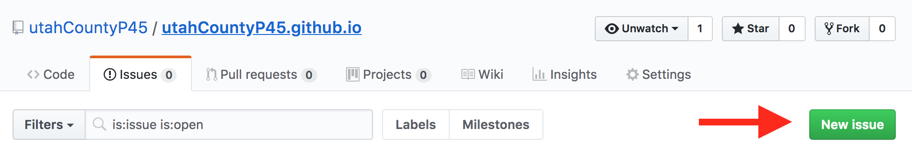

# Objectives
1. Provide transparent access to delegates and candidates in order to amplify the voices of our own community.
2. Collaborate in researching the relevant political offices, candidates, and issues in order to inform the members of our community.
3. Organize ourselves locally in order to foster self-reliance and cohesion  within our community.

By creating and contributing to this project we intend enable delegates and citizens of the 45th precinct to find and publish information relevant to our community this election year. However, more important than party victories is assuring that our neighborhood is adequately organized and represented.

---
# How to use this website

We hope that this website provides valuable information about political candidates as well as the ideas and concerns of our community members. We plan to achieve this with community sourced profiles on the candidates and a transparent and accessible means to leverage the interactions our precinct delegates are having with candidates.

## Community Questions & Comments
In order to facilitate relevant conversation with the citizens in our community and the candidates running for public office we are attempting to facilitate this with github and google forms (for now). Not only will this make it easier for you to transparently communicate with and through our delegates, but it will allow for full transparency and hopefully reduce repetition.

If relevant, please include to which candidate or public office you'd like to direct your question or comment.

#### Submitting with GitHub

In order to submit questions via git all you need to do is [create an issue](https://github.com/utahCountyP45/utahCountyP45.github.io/issues).

This requires you to create a free github account if you don't already have one. If you plan on being a regular participant or contributor with this project we suggest that you go ahead and create this account. It will enable to you be notified about the project.

Other options will be available soon.

## Candidate profiles
We want to provide profiles for all candidates (federal, state, county, and city) that will be on the ballots for our precinct this fall. Again, this information is community sourced with full transparency about who is sourcing the information by using github to manage all contributions, including edits. **This is where we need the most help**

[Federal Elections](/Candidates/federalElections.md)

[Utah State Elections](/Candidates/stateElections.md)

[Utah County Elections](/Candidates/countyElections.md)

[Provo City Elections](/Candidates/cityElections.md)

## Delegate Notes

Justin Stark, a county delegate, will be including all of his personal notes in this repository. These notes can be found [here](https://github.com/jjamesstark/ucP45/tree/master/Candidates/js_notes)
